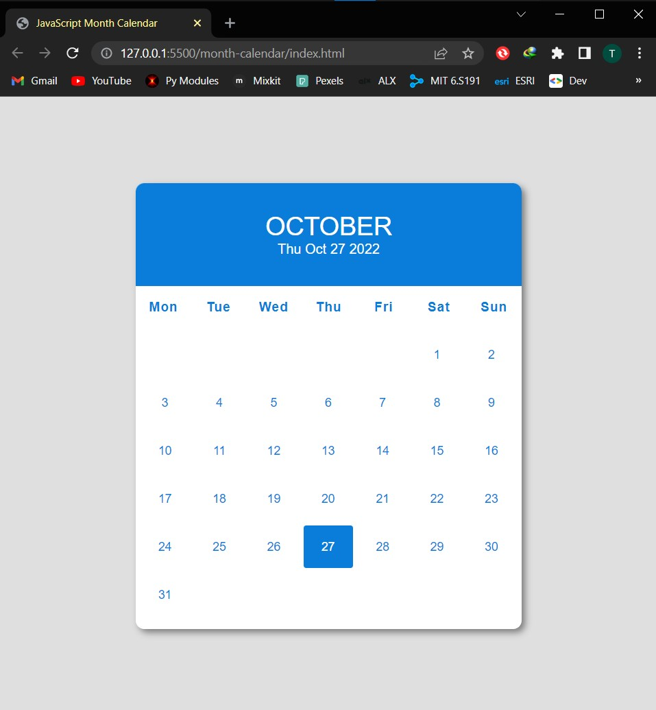

# JavaScript Month Calendar

Dynamic monthly calendar with current day highlighting built with HTML, CSS and JavaScript.

### Screenshot



---

```js
console.log("Hello World!🎉🎉");
```

## Author

LinkedIn - [Thomas Burns Botchwey](https://www.linkedin.com/in/tbbotchwey)
