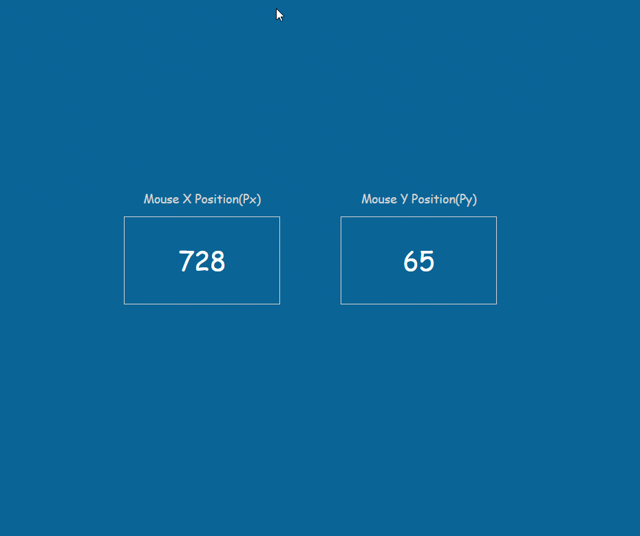

# JavaScript Mouse Position Tracker

Mouse position tracker to that tracks both X and Y positions when moving the mouse.

### Preview



---

```js
console.log("Hello World!🎉🎉");
```

## Author

LinkedIn - [Thomas Burns Botchwey](https://www.linkedin.com/in/tbbotchwey)
